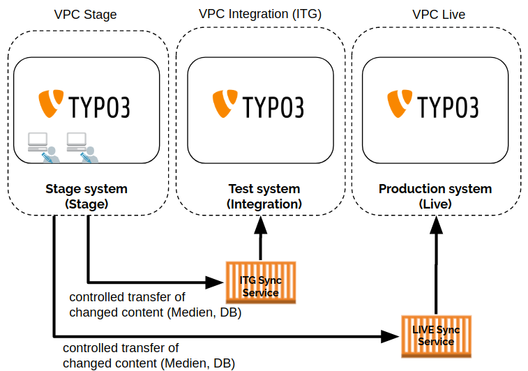

[](https://github.com/netresearch/t3x-sync/releases/latest)
[](https://github.com/netresearch/t3x-sync/blob/main/LICENSE)
[](https://github.com/netresearch/t3x-sync/actions/workflows/ci.yml)
[](https://crowdin.com/project/typo3-extension-nr-sync)

# nr-sync - TYPO3 Content Synchronization

## Introduction

| NOTE: Please be aware that this extension is an alpha version. A lot of refactoring and development is still required to make it "production" ready. Contribution appriciated . |
| --- |

* Prepares your Content for a synchronization wherever you want
* Easy integration for your own extensions
* No content editing on live systems anymore

## Description



The extension provides an easy and editor friendly way to prepare the content for a synchronization to other
environments e.g. live, testing or development systems. All the synchronizations can be done complete or
incremental to keep the required load to an absolute minimum. The extension won't do the synchronization by itself.


## Installation

### Composer
``composer require netresearch/nr-sync``

### GIT
``git clone git@github.com:netresearch/t3x-sync.git``


## Development
### Testing
```bash
composer install

composer ci:cgl
composer ci:test
composer ci:test:php:phplint
composer ci:test:php:phpstan
composer ci:test:php:rector
```
